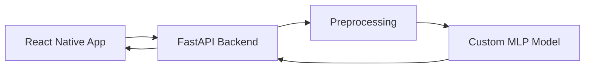

# Fuel Price App

Fuel Price App is a mobile application prototype for predicting fuel prices based on historical and contextual data.

The project combines a custom-built neural network, a FastAPI backend, and a React Native frontend into a single end-to-end system.

---

## Current Status

**Work in progress**

- The full system architecture (frontend → backend → model) is implemented and running  
- The prediction pipeline is integrated end-to-end  
- Due to missing trained weights and the use of placeholder data, current predictions are not meaningful  

The focus of the project is on building a complete machine learning application pipeline. Model performance and training are currently being improved.

---

## Features

- Mobile UI built with React Native / Expo  
- Backend API using FastAPI  
- Custom Multi-Layer Perceptron (MLP) implemented from scratch (NumPy)  
- Data preprocessing and feature handling  
- End-to-end integration of UI, backend, and model  
- Fallback mechanisms for missing data (demo-ready setup)  

---

## Architecture

## Limitations

- The current model does not produce meaningful predictions due to missing trained weights  
- Placeholder (dummy) data is used to keep the system runnable  
- The project is a prototype and not production-ready  
