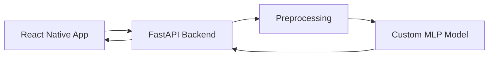

# Fuel Smart

🚀 **Live Demo:** https://fuelsmart.expo.app

Fuel Smart is a mobile application prototype for predicting fuel prices based on historical and contextual data.

The project combines a custom-built neural network, a FastAPI backend, and a React Native frontend into a single end-to-end system.

---

## Current Status

**Almost complete – deployed prototype**

- The full system (frontend → backend → model) is implemented and **live**
- The app is accessible online and fully functional from a system perspective
- End-to-end prediction pipeline is working

⚠️ **Current bottleneck:**  
The model is not yet properly trained, resulting in poor prediction quality.

The current development focus is on:

- Improving data quality
- Training the neural network properly
- Optimizing model performance

---

## Features

- Mobile UI built with React Native / Expo
- FastAPI backend serving predictions via REST API
- Custom Multi-Layer Perceptron (MLP) implemented from scratch using NumPy
- End-to-end ML pipeline (data → preprocessing → prediction → UI)
- Modular architecture for easy model iteration
- Online deployment (accessible prototype)

---

## Architecture

## Limitations

- The model currently performs poorly due to insufficient / ineffective training
- Predictions are not yet reliable for real-world use
- Data quality and feature engineering still need improvement
- The project is still a prototype and not production-ready
